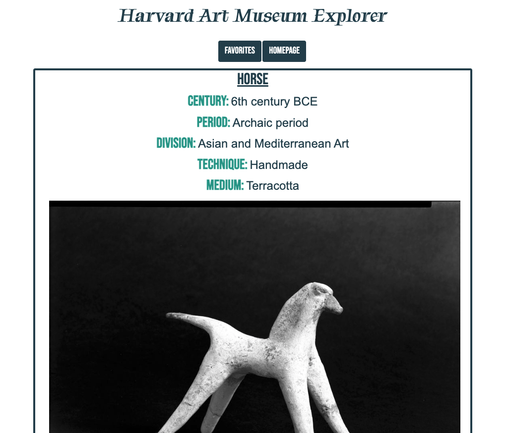
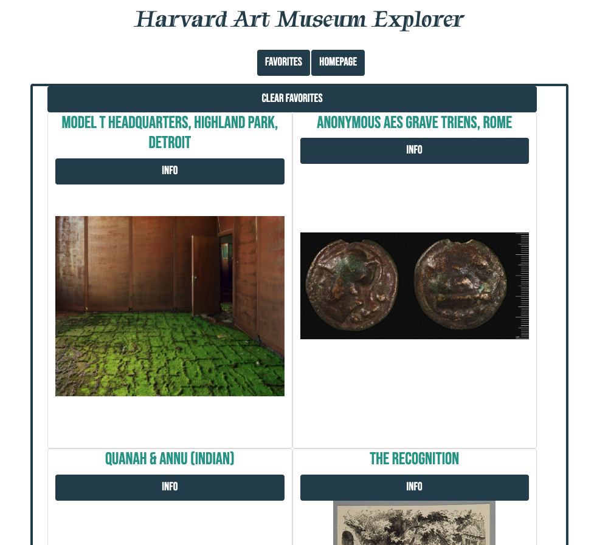

# Harvard Art Museum Explorer

## This is an application to explore different objects from the Harvard Art Museum using API calls. Choose from a set of parameters (techniques) and be presented with four images of art. Choose your favorite image and be given more information about it. Each favorited image will be saved to go back to.  

### All content besides the buttons is generated dynamically with javascript. I used Bootstrap's SASS to alter the primary colors. Setting that up involved using node.js and npm commands to build out the correct file structure.

 

[Check it out HERE](https://tbro4.github.io/harvard-art-museum/)

 

### Choose search parameters (techniques). These choices are added to the initial API call to specify the search. If no choices are clicked, the API call will find four random objects of any category from the museum (as long as there is a picture in the object's data).

### Choose favorite of four randomly generated pics

### See info about chosen favorite

### Click favorites button to see saved favorites. Click on "info" button to see pic info again

