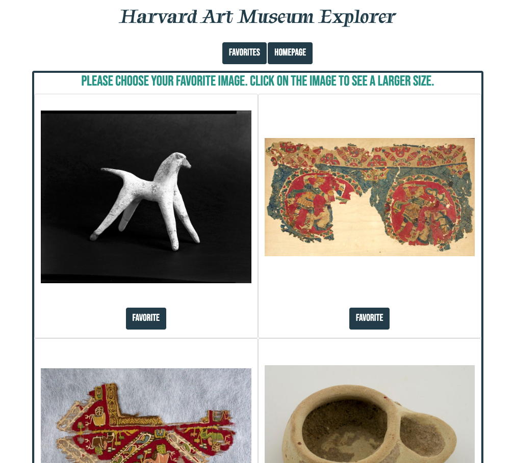

# Harvard Art Museum Explorer

## This is an application to explore different museum objects from the Harvard Art Museum. Choose from a set of parameters (techniques) and be presented with four images of art. Choose your favorite image and be given more information about it. Each favorited image will be saved to go back to.

 

[Check it out HERE](https://tbro4.github.io/harvard-art-museum/)

 

## Choose search parameters (techniques)

## Choose favorite of four randomly generated pics

## See info about chosen favorite

## Click favorites button to see saved favorites

